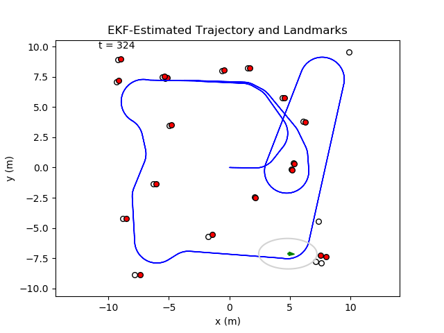

This is a ROS structure to perform online EKF-SLAM.

# EKF Landmark-Based SLAM Demo
To run the EKF demo, first run the following commands after cloning this repo.

    cd ekf_ws
    catkin_make
    source devel/setup.bash

Then choose one of the demos to run. So far I've implemented an EKF in both Python and C++, as well as a particle filter (which doesn't work great yet).

    roslaunch ekf_pkg cpp_ekf_demo.launch DT:=0.05 map:=random
    roslaunch ekf_pkg ekf_slam_demo.launch DT:=0.05 map:=random
    roslaunch ekf_pkg pf_demo.launch DT:=0.05 map:=random

The `DT` argument sets the time between iterations. If you set this lower than your machine can handle, the filter will miss measurements and begin to fail. The `map` argument determines how data is created for the filter(s).
 - `map:=random` randomly spreads landmarks across the map, and uses a TSP-inspired process to generate a trajectory that wanders the environment.
 - `map:=grid` creates a definite grid of landmarks as the map, and creates the trajectory in the same way as for random map.
 - `map:=demo_full` uses the map and data produced from following steps in Peter Corke's textbook Robotics Vision & Control. This map/trajectory is interesting, as the robot has long stretches where it can observe no landmarks, and we see the uncertainty drop each time a previously-seen landmark finally comes back into view.
 - `map:=demo_map` uses the demo map but generates a new trajectory and the measurements.

I've standardized all the filters to take in an odometry command (distance, heading) and a set of landmark detections (ID, range, bearing) for each timestep, so we can use the same data generation node for all of them. I've also standardized the creation of the live plot to use the `EKFState` or a particle set.

My full derivation of the math for the EKF is [included as a pdf](docs/EKF_SLAM_Derivation.pdf). It contains separate derivations for EKF Localization, EKF Mapping, and the combined EKF-SLAM which is implemented in this codebase. I've implemented Online SLAM, meaning we simultaneously estimate the current vehicle pose and the landmark positions, but we don't retroactively estimate all previous vehicle poses. That larger problem is called Full SLAM.

A plot of what a run of `roslaunch ekf_pkg cpp_ekf_demo.launch DT:=0.05 map:=random` produced. When running the code, the plot updates live to show the belief at the current timestep. The empty circles is the true map, the red circles are the map estimate, the blue line is the true overall trajectory, and the green arrow shows the estimate of the current vehicle position and orientation. The grey ellipse shows the covariance, i.e., uncertainty in the vehicle pose estimate. 

# Next Steps
My next goal is to use a camera to detect AprilTags in the real world to use as landmarks. Using the laptop webcam, I already have AprilTag detection working fine, but the problem is that I cannot get odometry "commands" for something I'm holding and manually moving around. Thus, my goal is to place a camera on a small mobile robot, and design its controller to accept distance and heading, just as the simulated robot used to generate the data in this demo. 