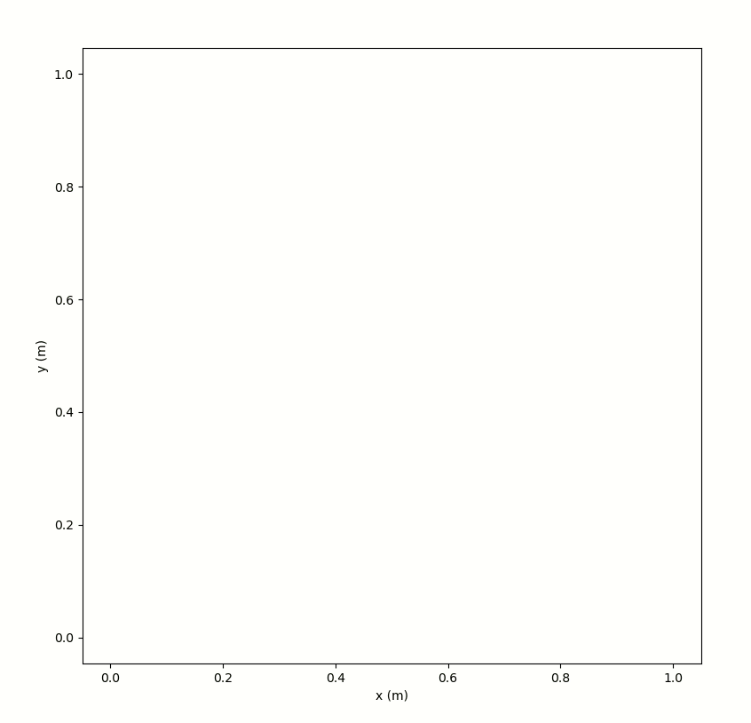
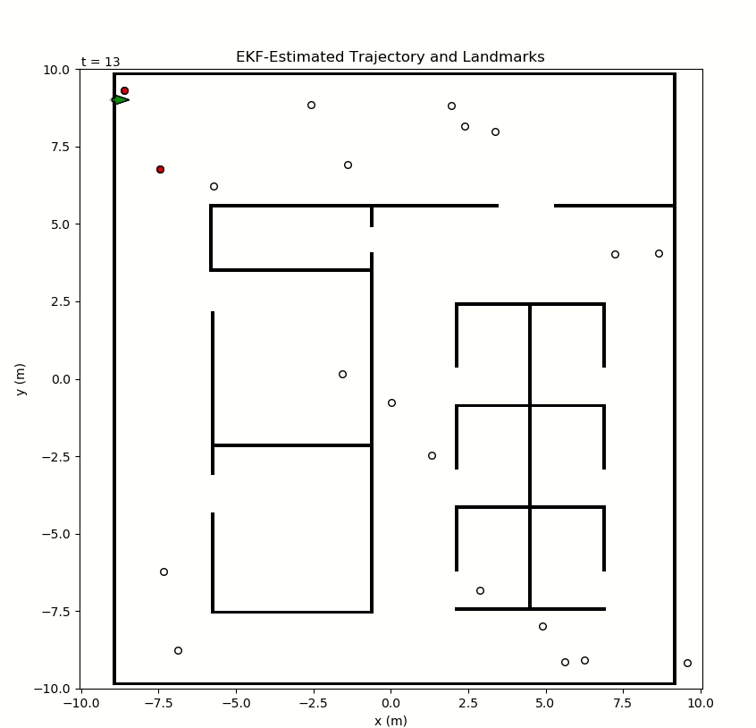

# Overview

This is a fully custom ROS structure to perform online EKF-SLAM. I've designed a crude simulator, which accepts the commanded forward and angular velocity for the next timestep, and moves the "real" vehicle according to a specified noise profile. It then generates noisy measurements of all landmarks within some specified vision range and FOV, which each come in the form of an ID with range and bearing relative to the vehicle. (Data association may or may not be performed, as each landmark measurement does include a unique ID, which a filter may ignore based on a yaml flag.) 

The "world" is comprised of both an occupancy map and a list of landmark positions. The landmark detections are used for the SLAM filters, and the occupancy map is used for path planning to avoid collisions. I've not actually implemented any collision detection in the simulator, but we can visually check how it's performing. A plotting node allows anything to be visualized, including the true occupancy/collision map, the true landmark locations, the true current vehicle pose, and the current estimates of the vehicle and landmark positions.

I've made this very modular, so the Filter for localization is an abstract class which any specific filter implementation can inherit from. So far, I have implemented the following filters (all in C++):
 - Naive filter which just does command-propagation as a baseline.
 - Extended Kalman Filter (EKF) SLAM.
 - Unscented Kalman Filter (UKF) Localization and SLAM.
 - Pose-Graph SLAM.

The trajectory that the vehicle pursues can also be generated in a variety of ways. I have implemented a few approaches:
 - Treat the landmark map as a "travelling salesman problem" and autonomously generate a full trajectory that ensures the vehicle will pass by all landmarks at some point during the runtime. The entire trajectory is known at the start, and is published for the filter/plotter one at a time. This is the default mode for the filter demos, since no interaction from the user is required, and it will move around the full map.
 - Let the user click on the map somewhere, and use A* on the occupancy map to find a path there. If one exists, navigate along its trajectory either directly or using Pure Pursuit. 
 - Only allow the planner access to a local area of the map in front of the vehicle, as our IGVC robot would have from its camera. It chooses an arbitrary free point ahead on this local map, plans a path to it with A*, and navigates there with Pure Pursuit. This allows the vehicle to autonomously navigate endlessly around looped track courses as long as it doesn't get itself stuck.

EKF-SLAM           |       EKF-SLAM
:-------------------------:|:-------------------------:
  |  

Local Planning           |      UKF-SLAM
:-------------------------:|:-------------------------:
  |  

Pursuing Clicked Point           |       Pursuing Clicked Point
:-------------------------:|:-------------------------:
  |  

Some key parameters are set using command line arguments, which have different default values in each launch file to ensure the proper setup for the different demos. These can also be changed when running the launch files by appending `arg:=choice` (e.g. `landmark_map:=random`). All other parameters can be modified in `base_pkg/config/params.yaml`. Additional occupancy maps can be added to `data_pkg/config/maps`.

My full derivations of the math for this project are included in the [docs folder](docs/).

# Running it
To run any of these demos, first run the following commands after cloning this repo to build the project.

    cd ekf_ws
    catkin_make
    source devel/setup.bash

Set the filter to use in `params.yaml` at the very top with the `filter` parameter. If using `pose_graph`, set the secondary filter lower down in the `pose_graph:` section.
Then run one of the launch files in the `base_pkg/launch` directory. The `sim_base.launch` is run automatically by all others to get the simulation working. Some that give good results are:

    roslaunch base_pkg filter_demo.launch
    roslaunch base_pkg igvc1.launch
    roslaunch base_pkg filter_demo.launch landmark_map:=grid

Note: The `dt` parameter in `data_pkg/config/params.yaml` sets the time between iterations for the entire simulation. Lowering this value makes everything run faster, but if you set this lower than your machine can handle, it will be very choppy and potentially fail. This value can also be overridden by a launch file with the argument `timer_period`.

