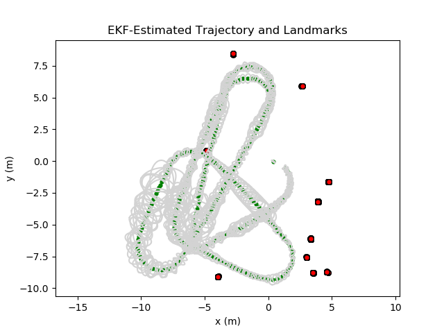

This is a ROS structure to perform live EKF SLAM.

# EKF Landmark-Based SLAM Demo
To run the EKF standalone, without a robot and a camera and all that, simply run the following commands.

    cd ekf_ws
    catkin_make
    source devel/setup.bash
    roslaunch ekf_pkg rss_ekf_test.launch dt:=0.1

This uses a pre-generated dataset of odometry commands (distance, heading) and measurements of one or more landmarks (ID, range, bearing) at each timestep for the duration. The `ekf_node` subscribes to the commands and measurements, and publishes a list containing the covariance of the vehicle pose and the full state, which includes the vehicle $x$, $y$, $\theta$, as well as $x$, $y$ for all landmarks that have been detected so far. 

The `data_fwd_node` reads data from the file and publishes it at the desired frequency for the EKF. In any other application, this node should not be run. This data was part of an assignment in CS-5335: Robotic Science and Systems at Northeastern University.

The `plotting_node` subscribes to the published state/covariance to create a live plot of the current estimated position and covariance, as well as all landmarks detected. The grey ellipses represent the covariance in vehicle position, growing larger with more uncertainty and smaller when the estimates are very confident. When running this demo, we can see that the uncertainty increases and the position drifts constantly, but it jumps back on track and shrinks the covariance when a landmark is detected. This plot will be saved to file in `ekf_pkg/plots` when you exit the program with Ctrl+C.

<!-- # EKF Derivation -->

# Next Steps
My next goal is to use a camera to detect AprilTags in the real world to use as landmarks. Using the laptop webcam, I already have AprilTag detection working fine, but the problem is that I cannot get odometry "commands" for something I'm holding and manually moving around. Thus, my goal is to place a camera on a small mobile robot, and design its controller to accept distance and heading, just as the simulated robot used to generate the data I'm using as a demo. 